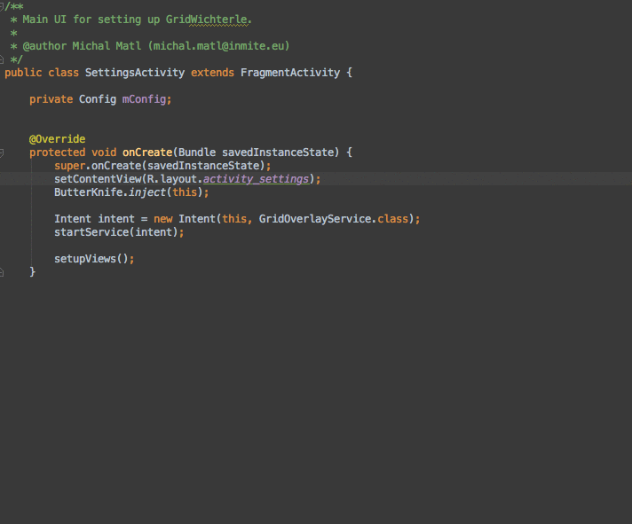

# ButterKnifeZelezny

Simple plug-in for Android Studio/IDEA that allows one-click creation of [Butterknife](https://github.com/JakeWharton/butterknife) view injections.

## How to install

- in Android Studio: go to `Preferences → Plugins → Browse repositories` and search for `ButterKnife Zelezny`

_or_

- [download it](http://plugins.jetbrains.com/plugin/7369) and install via `Preferences → Plugins → Install plugin from disk`

## How to use it

 

 1. Make sure you have latest [Butterknife](https://github.com/JakeWharton/butterknife) lib on your classpath
 2. Right click on usage of desired layout reference (e.g. R.layout.main in your Activity or Fragment), then `Generate` and `Generate ButterKnife Injections`
 3. Pick injections you want, you also have an option to create ViewHolder for adapters.
 4. Click `Confirm` and enjoy injections in your code with no work!

## Contributing

Pull requests are welcomed!

- make sure you stick to [our coding style](/code-formatting-config.xml).
- follow [Getting Started with Plugin Development](http://confluence.jetbrains.com/display/IDEADEV/Getting+Started+with+Plugin+Development)
- make sure you have Java 6 installed if you want to publish it in the plugin repository
- initial project setup might be tricky (like editing iml files manually), don't hesitate to contact [@destil](http://github.com/destil) if you run into troubles.

## Common issue: The plugin is not working after I updated to new Android Studio
- AS promts you to update plugins after update, you need to update them before using
- Make sure you have Butterknife on your classpath
- Make sure that your cursor is on layout file in Activity on Fragment

## Why 'Zelezny'?

[Jan Železný](http://en.wikipedia.org/wiki/Jan_%C5%BDelezn%C3%BD) is a famous Czech javelin thrower, Olympic champion and world record holder. With Zelezny's javelin, your butter knife will be much sharper!

See [**our other Czech personalities**](http://inmite.github.io) who help with [#AndroidDev](https://plus.google.com/s/%23AndroidDev).
