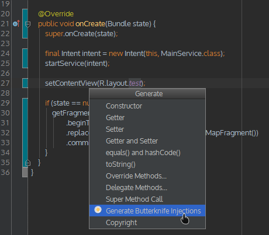
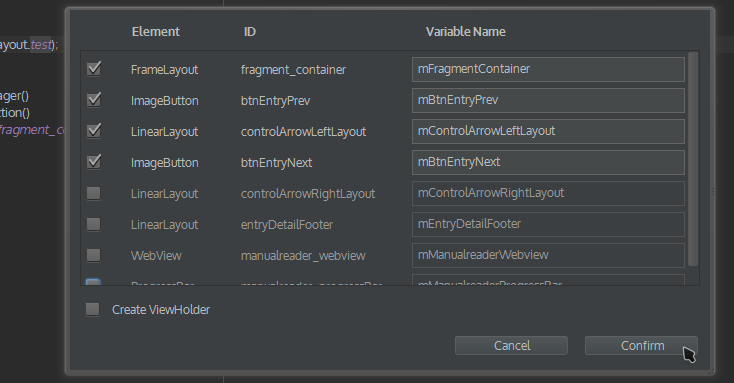

# ButterKnifeZelezny

Simple plug-in for IntelliJ IDEA and Android Studio that allows one-click creation of ButterKnife view injections.

## How to install

- in Android Studio: go to `Preferences → Plugins → Browse repositories` and search for `ButterKnife Zelezny`

_or_

- [download it](http://plugins.jetbrains.com/plugin/7369) and install via `Preferences → Plugins → Install plugin from disk`

## How to use

1) Right click on usage of desired layout file (e.g. setContentView(R.layout.main)), then `Generate` and `Generate ButterKnife Injections`

 
 
2) Pick injections you want, rename them to whatever you want. Also you have option to create ViewHolder for adapters.

 

You need to include [Butterknife library](https://github.com/JakeWharton/butterknife) into your project in order to make this work.

## Other's work

- IDEA code generator by Anatoly Korniltsev [https://github.com/kurganec/intellij-android-codegenerator/]
